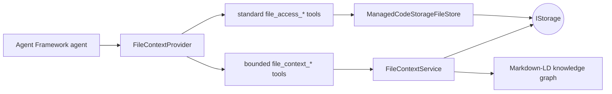

# ManagedCode.FileContext

[](https://github.com/managedcode/FileContext/actions/workflows/ci.yml)
[](https://www.nuget.org/packages/ManagedCode.FileContext)
[](LICENSE)
[](https://dotnet.microsoft.com/)

Bounded, provider-neutral file tools and Markdown knowledge-graph context for Microsoft Agent Framework.

`ManagedCode.FileContext` turns any [`ManagedCode.Storage.Core.IStorage`](https://github.com/managedcode/Storage) implementation into an Agent Framework file context. An agent can read, list, grep, create, edit, and delete files through the framework's standard `file_access_*` tools; use bounded line-range and metadata tools for large files; and build/search/export a linked-data graph from Markdown through [`ManagedCode.MarkdownLd.Kb`](https://github.com/managedcode/markdown-ld-kb).

The storage provider remains your choice: local filesystem, Azure Blob Storage, Amazon S3, Google Cloud Storage, SFTP, browser storage, or another ManagedCode.Storage provider all share the same agent-facing contract.

## Why FileContext?

Models need more than “attach this file.” Effective file work is iterative:

1. list the available files;
2. search for relevant text or file patterns;
3. inspect metadata before an expensive read;
4. read only the relevant line window;
5. move forward or backward through the file;
6. optionally edit the selected content;
7. connect concepts across Markdown documents as a graph.

FileContext provides that workflow without binding the agent to a physical filesystem.



## Install

```bash
dotnet add package ManagedCode.FileContext --version 0.0.2
```

Add one concrete ManagedCode.Storage provider to the host application. For a local filesystem:

```bash
dotnet add package ManagedCode.Storage.FileSystem
```

## Quick start

```csharp
using ManagedCode.FileContext;
using ManagedCode.Storage.Core;
using ManagedCode.Storage.FileSystem;
using ManagedCode.Storage.FileSystem.Options;
using Microsoft.Agents.AI;
using Microsoft.Extensions.AI;
using Microsoft.Extensions.DependencyInjection;

var services = new ServiceCollection();

IStorage storage = new FileSystemStorage(new FileSystemStorageOptions
{
    BaseFolder = Path.Combine(AppContext.BaseDirectory, "agent-workspace"),
    CreateContainerIfNotExists = true,
});

services.AddManagedCodeFileContext(storage, options =>
{
    options.RootPrefix = "project";
    options.RequireReadToolApproval = false;
    options.EnableWriteTools = false;
});

await using var serviceProvider = services.BuildServiceProvider();
var fileContext = serviceProvider.GetRequiredService<FileContextProvider>();

// `modelClient` is any Microsoft.Extensions.AI IChatClient.
using var contextAwareClient = modelClient
    .AsBuilder()
    .UseAIContextProviders(fileContext)
    .UseFunctionInvocation()
    .Build();

var agent = new ChatClientAgent(
    contextAwareClient,
    new ChatClientAgentOptions { UseProvidedChatClientAsIs = true });

var response = await agent.RunAsync(
    "Find the retry policy in the Markdown docs and show the relevant lines.");
```

`UseFunctionInvocation()` executes function calls returned by the model. In interactive applications, keep the default approval requirement and add Agent Framework's tool-approval flow. The example disables approval only to show a non-interactive read-only setup.

## Available tools

Standard tools are supplied by Microsoft Agent Framework's `FileAccessProvider`, so existing Agent Framework prompts and tool-call payloads remain compatible.

| Tool | Purpose | Default |
| --- | --- | --- |
| `file_access_read` | Read an entire bounded text file | Enabled, approval required |
| `file_access_ls` | List direct children of a directory | Enabled, approval required |
| `file_access_grep` | Case-insensitive regex search with optional glob/directory filters | Enabled, approval required |
| `file_access_write` | Write or append text | Disabled |
| `file_access_delete` | Delete a file | Disabled |
| `file_access_replace` | Replace exact text | Disabled |
| `file_access_replace_lines` | Replace selected lines | Disabled |
| `file_context_read_range` | Read a one-based bounded line window and report whether more lines exist | Enabled, approval required |
| `file_context_info` | Inspect size, media type, and modification time without reading content | Enabled, approval required |
| `file_context_markdown_graph_search` | Build and ranked-search a graph from scoped Markdown files | Enabled, approval required |
| `file_context_markdown_graph_export` | Export the graph as Mermaid, DOT, Turtle, or JSON-LD | Enabled, approval required |

Enable modification tools explicitly:

```csharp
services.AddManagedCodeFileContext(storage, options =>
{
    options.EnableWriteTools = true;
    options.RequireWriteToolApproval = true;
});
```

## Use the API without an agent

`IFileContext` exposes the extended operations directly:

```csharp
var context = serviceProvider.GetRequiredService<IFileContext>();

var page = await context.ReadRangeAsync("logs/build.log", startLine: 401, lineCount: 100);
if (page.HasMore)
{
    var nextPage = await context.ReadRangeAsync("logs/build.log", page.EndLine + 1, 100);
}

var graph = await context.SearchMarkdownGraphAsync("storage provider lifetime", "docs");
var mermaid = await context.ExportMarkdownGraphAsync(MarkdownGraphFormat.Mermaid, "docs");
```

## Keyed storage

Hosts with multiple workspaces can bind FileContext to keyed `IStorage` instances:

```csharp
services.AddKeyedSingleton<IStorage>("tenant-a", tenantAStorage);
services.AddKeyedManagedCodeFileContext("tenant-a", options =>
{
    options.RootPrefix = "agents/research";
});

var provider = serviceProvider.GetRequiredKeyedService<FileContextProvider>("tenant-a");
```

## Limits and safety

Every path must be relative and `/`-separated. Rooted paths, `.`/`..` segments, backslashes, empty segments, and NUL characters are rejected before storage access. `RootPrefix` creates a logical workspace boundary and is never returned to the model.

Write tools are off by default. Read and write approvals are on by default. File contents are returned only as tool results and are explicitly treated as untrusted data rather than promoted to system instructions.

Potentially expensive operations are bounded by `FileContextOptions`:

| Option | Default |
| --- | ---: |
| `MaximumFullReadBytes` | 1 MiB |
| `MaximumRangeReadBytes` | 256 KiB |
| `DefaultRangeLineCount` / `MaximumRangeLineCount` | 200 / 1,000 |
| `MaximumSearchFiles` | 500 |
| `MaximumSearchFileBytes` | 4 MiB |
| `MaximumSearchResults` / `MaximumMatchesPerFile` | 100 / 20 |
| `RegexTimeout` | 2 seconds |
| `MarkdownGlob` | `**/*.md` |
| `MaximumMarkdownFiles` | 100 |
| `MaximumMarkdownSourceBytes` | 1 MiB per file |
| `MaximumGraphResults` | 20 |
| `MaximumGraphExportCharacters` | 200,000 |

See [Security](docs/Security.md) for the trust model and operational guidance.

## Storage-provider compatibility

Product code references only `ManagedCode.Storage.Core`; it does not depend on a concrete provider. The adapter uses metadata enumeration plus streaming reads and ordinary storage operations, which keeps the agent contract consistent across providers. Provider credentials, container creation, and lifetime remain the host application's responsibility.

## Tests

The integration-first test suite uses a unique real filesystem root per test. LlmTck HTTP replays invoke every advertised `file_access_*` and `file_context_*` tool through the actual Agent Framework function loop, then assert the resulting file content or structured tool result. A sparse 1 GiB file scenario verifies bounded range reads, allocation limits, and fail-fast handling for an oversized single line. No live model or API key is required.

```bash
dotnet restore ManagedCode.FileContext.slnx
dotnet format ManagedCode.FileContext.slnx --verify-no-changes
dotnet build ManagedCode.FileContext.slnx --configuration Release
dotnet test tests/ManagedCode.FileContext.Tests/ManagedCode.FileContext.Tests.csproj --configuration Release /p:CollectCoverage=true
```

The coverage command enforces at least 95% line coverage for the product assembly and writes an OpenCover report under the test project's `TestResults/coverage` directory.

## Documentation

- [Architecture](docs/Architecture.md)
- [Feature contract](docs/Features/file-context.md)
- [API overview](docs/API/index.md)
- [Development setup](docs/Development/setup.md)
- [Testing](docs/Testing/index.md)
- [Security](docs/Security.md)

## Release policy

The package version is defined in `Directory.Build.props`. Pull requests and `main` run the required `build-and-test` workflow. NuGet publication is allowed only from the tag-driven GitHub Actions release workflow, and a tag such as `v0.0.2` must exactly match the evaluated package version. The repository intentionally provides no local publish script.

## License

ManagedCode.FileContext is licensed under the [MIT License](LICENSE).
