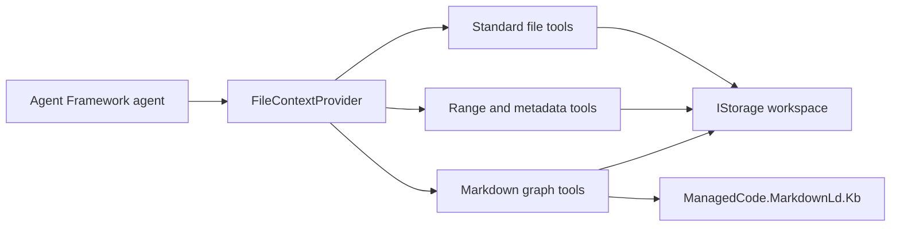

# ManagedCode.FileContext

**Give your .NET agents a workspace they can explore, understand, and edit.**

[](https://www.nuget.org/packages/ManagedCode.FileContext)
[](https://github.com/managedcode/FileContext/actions/workflows/ci.yml)
[](https://github.com/managedcode/FileContext/actions/workflows/codeql.yml)
[](https://dotnet.microsoft.com/)
[](https://github.com/managedcode/FileContext/blob/main/LICENSE)

FileContext connects [ManagedCode.Storage](https://github.com/managedcode/Storage) to **Microsoft Agent Framework**. Agents can discover files, search their contents, read relevant line ranges, and work across Markdown documents as a knowledge graph. Enable write tools when the agent needs to create or edit files.

Your host supplies an `IStorage` backend and a model client. FileContext supplies the scoped file tools.

[Quick start](#quick-start) · [Agent integration](#connect-an-agent) · [Tools](#tool-catalog) · [Limits](#bounds-and-workspace-isolation) · [Documentation](#documentation)

## What you get

| Capability | What the agent can do |
| --- | --- |
| File discovery | List directories and grep text with regex and glob filters |
| Bounded reads | Inspect metadata, read a line window, and follow continuation information |
| File editing | Create, overwrite, delete, replace text, or edit selected lines when enabled |
| Markdown knowledge graphs | Search concepts across `.md` documents and export Mermaid, DOT, Turtle, or JSON-LD |
| Multiple files | Issue independent tool calls in one turn, with optional concurrent execution |
| Workspace isolation | Resolve logical paths under a configured storage prefix |
| Observable results | Receive structured `found` / `not_found` metadata results that survive session restoration |

Product code depends only on `ManagedCode.Storage.Core`, so concrete storage providers stay in your application. The integration suite exercises the real filesystem provider; other backends use the same `IStorage` contract.



## Install

Requires **.NET 10**. Add FileContext and the storage provider your application uses:

```bash
dotnet add package ManagedCode.FileContext --version 1.0.0
dotnet add package ManagedCode.Storage.FileSystem --version 10.0.7
```

The examples below also use the DI service-provider implementation:

```bash
dotnet add package Microsoft.Extensions.DependencyInjection --version 10.0.11
```

## Quick start

This example creates a local workspace, adds a Markdown document through the direct storage API, and reads just its second line. It runs without a model or API key.

```csharp
using ManagedCode.FileContext;
using ManagedCode.Storage.FileSystem;
using ManagedCode.Storage.FileSystem.Options;
using Microsoft.Extensions.DependencyInjection;

using var storage = new FileSystemStorage(new FileSystemStorageOptions
{
    BaseFolder = Path.Combine(AppContext.BaseDirectory, "agent-workspace"),
    CreateContainerIfNotExists = true,
});

var created = await storage.CreateContainerAsync();
if (!created.IsSuccess)
{
    throw new IOException("Could not initialize the file workspace.");
}

var services = new ServiceCollection();
services.AddManagedCodeFileContext(storage, options =>
{
    options.RootPrefix = "project";
    options.RequireReadToolApproval = false;
});

await using var serviceProvider = services.BuildServiceProvider();
var store = serviceProvider.GetRequiredService<ManagedCodeStorageFileStore>();
await store.WriteAsync("docs/retries.md", "# Retry policy\nRetry transient errors up to three times.");

var context = serviceProvider.GetRequiredService<IFileContext>();
var page = await context.ReadRangeAsync("docs/retries.md", startLine: 2, lineCount: 1);
Console.WriteLine(page.Content);
// Retry transient errors up to three times.
```

The host creates the example file directly. Agent write tools remain disabled. Approval is disabled for reads in this example; the library defaults to requiring approval for both reads and writes.

## Connect an agent

Given the `serviceProvider` above and your configured `IChatClient modelClient`, add the context provider and the function-invocation pipeline:

```csharp
using Microsoft.Agents.AI;
using Microsoft.Extensions.AI;

var fileTools = serviceProvider.GetRequiredService<FileContextProvider>();
using var client = modelClient.AsBuilder()
    .UseAIContextProviders(fileTools)
    .UseFunctionInvocation()
    .Build();

var agent = new ChatClientAgent(client,
    new ChatClientAgentOptions { UseProvidedChatClientAsIs = true });

var response = await agent.RunAsync(
    "Find the retry policy in docs and quote the relevant lines.");
Console.WriteLine(response.Text);
```

`modelClient` is supplied by your model-provider integration. `UseFunctionInvocation()` executes the tools requested by the model. Hosts keeping the default approval settings must also handle Agent Framework's approval flow.

## Tool catalog

Standard `file_access_*` tools come from Agent Framework's `FileAccessProvider`. FileContext adds complementary range, metadata, and Markdown tools.

| Tool | Purpose | Enabled by default |
| --- | --- | :---: |
| `file_access_ls` | List direct children of a directory | Yes |
| `file_access_grep` | Search text with case-insensitive regex and optional glob filters | Yes |
| `file_access_read` | Read an entire text file within the full-read limit | Yes |
| `file_context_read_range` | Read a bounded, one-based line window | Yes |
| `file_context_info` | Return file presence and metadata without reading content | Yes |
| `file_context_markdown_graph_search` | Build and ranked-search a Markdown knowledge graph | Yes |
| `file_context_markdown_graph_export` | Export a graph as Mermaid, DOT, Turtle, or JSON-LD | Yes |
| `file_access_write` | Create or overwrite text | No |
| `file_access_delete` | Delete a file | No |
| `file_access_replace` | Replace exact text | No |
| `file_access_replace_lines` | Edit selected lines | No |

All enabled tools require approval by default. Configure write access when registering the workspace:

```csharp
services.AddManagedCodeFileContext(storage, options =>
{
    options.EnableWriteTools = true;
    options.RequireWriteToolApproval = true;
});
```

### Explicit metadata results

A missing file is a normal lookup outcome. `file_context_info` returns:

```json
{"status":"not_found","path":"docs/missing.md"}
```

An existing file returns `status: "found"`, its logical `path`, and an `info` object containing `path`, `length`, `contentType`, and `lastModified`.

These results are tested through tool invocation, session serialization/restoration, and the next user request. The direct C# API, `IFileContext.GetInfoAsync`, retains its nullable metadata contract. Storage errors and invalid paths still fail; a missing file in a range read throws `FileNotFoundException`.

## Navigate large files

Read the needed window, then use its continuation metadata:

```csharp
var page = await context.ReadRangeAsync("logs/build.log", startLine: 401, lineCount: 100);
Console.WriteLine(page.Content);

if (page.HasMore)
{
    var next = await context.ReadRangeAsync("logs/build.log", page.EndLine + 1, 100);
    Console.WriteLine(next.Content);
}
```

Results include `StartLine`, `EndLine`, `HasMore`, and `TotalLines` when the end is reached. Reads stream through the file and retain only bounded content; non-seekable streams are supported. Files above the full-read limit must be accessed through range reads.

## Explore Markdown as a graph

Use [ManagedCode.MarkdownLd.Kb](https://github.com/managedcode/markdown-ld-kb) to connect and search concepts across the Markdown documents in your workspace:

```csharp
var matches = await context.SearchMarkdownGraphAsync("retry policy", "docs");
var graph = await context.ExportMarkdownGraphAsync(MarkdownGraphFormat.Mermaid, "docs");
Console.WriteLine(graph.Content);
```

Each operation builds from the current selected `.md` files, subject to document and size limits. Graph exports support **Mermaid, DOT, Turtle, and JSON-LD**. This package consumes existing Markdown; conversion from PDF, DOCX, or XLSX is outside its scope.

## Work with multiple files

A model turn can contain several tool calls, each with its own path and result. Function invocation is sequential by default. Enable concurrency in your client pipeline when operations are independent:

```csharp
.UseFunctionInvocation(configure: client => client.AllowConcurrentInvocation = true)
```

Direct API consumers can also use `Task.WhenAll` for independent reads:

```csharp
var pages = await Task.WhenAll(
    context.ReadRangeAsync("docs/retries.md", 1, 20),
    context.ReadRangeAsync("docs/timeouts.md", 1, 20));
```

The tests cover multiple calls in one model turn and concurrent writes/reads on eight separate files. Your storage provider must support the chosen concurrency. Serialize dependent operations and writes to the same path: FileContext provides no cross-file transaction or same-file write lock.

### Separate workspaces with keyed storage

Register keyed services before building the service provider. Each registration can have its own options and storage prefix:

```csharp
using ManagedCode.Storage.Core;

var workspaceServices = new ServiceCollection();
workspaceServices.AddKeyedSingleton<IStorage>("research", researchStorage);
workspaceServices.AddKeyedManagedCodeFileContext("research", options =>
{
    options.RootPrefix = "agents/research";
});

using var workspaces = workspaceServices.BuildServiceProvider();
var tools = workspaces.GetRequiredKeyedService<FileContextProvider>("research");
```

## Bounds and workspace isolation

Paths are logical, relative, and `/`-separated. `RootPrefix` scopes storage access. Path validation rejects traversal and unsafe path forms before storage calls. File contents remain untrusted tool data.

| Option | Default |
| --- | ---: |
| `MaximumFullReadBytes` | 1 MiB |
| `MaximumRangeReadBytes` | 256 KiB |
| `DefaultRangeLineCount` / `MaximumRangeLineCount` | 200 / 1,000 |
| `MaximumSearchFiles` | 500 |
| `MaximumSearchFileBytes` | 4 MiB |
| `MaximumSearchResults` / `MaximumMatchesPerFile` | 100 / 20 |
| `RegexTimeout` | 2 seconds |
| `MarkdownGlob` | `**/*.md` |
| `MaximumMarkdownFiles` | 100 |
| `MaximumMarkdownSourceBytes` | 1 MiB per file |
| `MaximumGraphResults` | 20 |
| `MaximumGraphExportCharacters` | 200,000 |

These settings are available through `FileContextOptions`; their named defaults are exposed by `FileContextDefaults`. Credentials, container lifecycle, authorization, and session persistence remain host responsibilities. When saving conversations, preserve tool-call/result pairs and handle interrupted turns before replaying history.

### Configure limits and timeouts

Every option in the table is configurable through `FileContextOptions`, for both default and keyed registrations. Configure the options before building your service provider:

```csharp
services.AddManagedCodeFileContext(storage, options =>
{
    options.MaximumFullReadBytes = 4 * 1024 * 1024;
    options.MaximumRangeReadBytes = 512 * 1024;
    options.DefaultRangeLineCount = 100;
    options.MaximumRangeLineCount = 2000;
    options.MaximumSearchFiles = 1000;
    options.MaximumSearchFileBytes = 8 * 1024 * 1024;
    options.MaximumSearchResults = 200;
    options.MaximumMatchesPerFile = 50;
    options.RegexTimeout = TimeSpan.FromSeconds(5);
    options.MarkdownGlob = "docs/**/*.md";
    options.MaximumMarkdownFiles = 250;
    options.MaximumMarkdownSourceBytes = 2 * 1024 * 1024;
    options.MaximumGraphResults = 50;
    options.MaximumGraphExportCharacters = 400000;
});
```

`RegexTimeout` is the only internal timeout. It limits **one regex match on one line**, protecting the process from excessive backtracking in a model-supplied pattern. It is not a two-second deadline for the whole search. Choose a finite positive value supported by .NET Regex. Size/count limits must be positive, and the default line count cannot exceed the maximum.

In a host that uses Microsoft configuration binding, the same options can come from `appsettings.json`, environment variables, or another configuration source:

```csharp
using Microsoft.Extensions.Configuration;

services.AddManagedCodeFileContext(storage, options =>
    configuration.GetSection("FileContext").Bind(options));
```

The host supplies `configuration` and the `Microsoft.Extensions.Configuration.Binder` package. For example:

```json
{
  "FileContext": {
    "MaximumFullReadBytes": 4194304,
    "MaximumRangeReadBytes": 524288,
    "DefaultRangeLineCount": 100,
    "MaximumRangeLineCount": 2000,
    "MaximumSearchFiles": 1000,
    "MaximumSearchFileBytes": 8388608,
    "MaximumSearchResults": 200,
    "MaximumMatchesPerFile": 50,
    "RegexTimeout": "00:00:05",
    "MarkdownGlob": "docs/**/*.md",
    "MaximumMarkdownFiles": 250,
    "MaximumMarkdownSourceBytes": 2097152,
    "MaximumGraphResults": 50,
    "MaximumGraphExportCharacters": 400000
  }
}
```

Options are bound at registration time; changing the configuration later does not automatically reconfigure an existing provider. For a deadline on an entire operation, pass a caller-controlled cancellation token:

```csharp
using var deadline = new CancellationTokenSource(TimeSpan.FromSeconds(30));
var results = await context.SearchMarkdownGraphAsync(
    "retry policy", "docs", cancellationToken: deadline.Token);
```

Here, 30 seconds is the caller's example budget, not a library default. Storage-client and model-client timeouts belong to their respective host integrations.

## Verified with real integrations

The suite runs against real filesystem storage, real Markdown graph builds, and an in-process LlmTck HTTP service using Agent Framework's actual function-invocation pipeline. No live model or API key is required.

Coverage includes all advertised tools, empty/error results, restored sessions, concurrent file operations, Unicode buffer boundaries, and bounded range reads from a sparse **1 GiB** file. CI enforces **at least 95% product line coverage**, formatting, static analysis, build, tests, and package validation.

```bash
dotnet restore ManagedCode.FileContext.slnx
dotnet format ManagedCode.FileContext.slnx --verify-no-changes
dotnet build ManagedCode.FileContext.slnx --configuration Release
dotnet test tests/ManagedCode.FileContext.Tests/ManagedCode.FileContext.Tests.csproj --configuration Release /p:CollectCoverage=true
dotnet pack src/ManagedCode.FileContext/ManagedCode.FileContext.csproj --configuration Release --no-build --output artifacts
```

## Documentation

| Guide | Contents |
| --- | --- |
| [Architecture](https://github.com/managedcode/FileContext/blob/main/docs/Architecture.md) | Components, storage boundaries, and invocation flow |
| [Feature contract](https://github.com/managedcode/FileContext/blob/main/docs/Features/file-context.md) | Behavior, failure modes, and verification scenarios |
| [API](https://github.com/managedcode/FileContext/blob/main/docs/API/index.md) | Public entry points and integration options |
| [Development](https://github.com/managedcode/FileContext/blob/main/docs/Development/setup.md) | Setup, commands, and static analysis |
| [Testing](https://github.com/managedcode/FileContext/blob/main/docs/Testing/index.md) | Integration coverage and quality gates |
| [Security](https://github.com/managedcode/FileContext/blob/main/docs/Security.md) | Trust model and operational guidance |
| [Changelog](https://github.com/managedcode/FileContext/blob/main/CHANGELOG.md) | Version history |

## Releases and license

Version `1.0.0` is defined centrally in `Directory.Build.props`. Every push to `main` runs the Release workflow: restore, format, build, test with coverage, and pack. For a new package version, it publishes the validated NuGet artifact and creates the matching tag and GitHub release automatically. Already released versions are skipped. To release an update, bump the version, commit, and push; no manual tag is required.

[MIT licensed](https://github.com/managedcode/FileContext/blob/main/LICENSE) · Built by [ManagedCode](https://github.com/managedcode)
