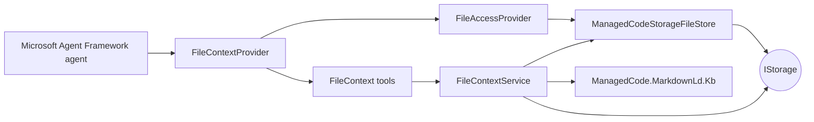
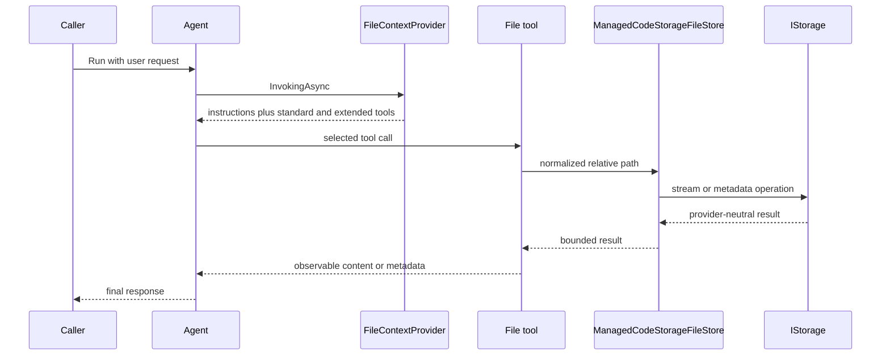
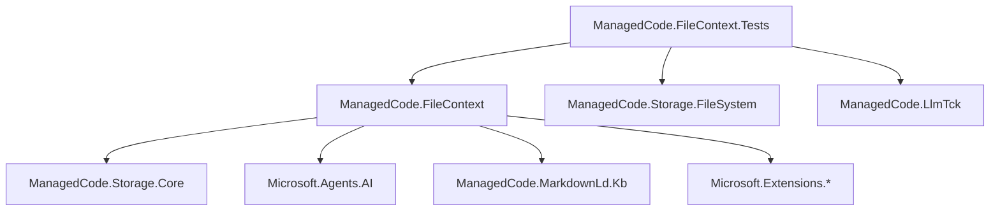

# Architecture

ManagedCode.FileContext is a narrow adapter between ManagedCode.Storage and Microsoft Agent Framework. It keeps storage-provider choice outside the package while adding agent-ready file and Markdown graph context.

## System map

## Invocation flow

## Modules and contracts

- [`ManagedCodeStorageFileStore`](https://github.com/managedcode/FileContext/tree/main/src/ManagedCode.FileContext) implements Microsoft `AgentFileStore` over `IStorage`. It owns path normalization, prefix isolation, direct-child projection, bounded full reads, and regex scanning.
- [`FileContextProvider`](https://github.com/managedcode/FileContext/tree/main/src/ManagedCode.FileContext) composes the Microsoft `FileAccessProvider` with package-owned read-range, metadata, and Markdown graph tools.
- [`IFileContext`](https://github.com/managedcode/FileContext/tree/main/src/ManagedCode.FileContext) is the direct application API for bounded range reads, metadata, graph search, and graph export.
- [`FileContextService`](https://github.com/managedcode/FileContext/tree/main/src/ManagedCode.FileContext) streams line windows and metadata, loads scoped Markdown through `IStorage`, builds a Markdown-LD knowledge graph, and maps results to package-owned records.
- [`FileContextServiceCollectionExtensions`](https://github.com/managedcode/FileContext/tree/main/src/ManagedCode.FileContext) is the composition root for default and keyed `IStorage` registrations.

## Dependency rules

- Product code may depend on `ManagedCode.Storage.Core` but never a concrete provider.
- Tests own concrete filesystem storage, LlmTck hosting, and OpenAI-compatible protocol dependencies.
- Microsoft owns the standard file-access tool names and behavior. This package adapts storage and adds only complementary tools.
- File contents remain untrusted data and are never elevated to system instructions.

## Operational limits

All potentially large operations are controlled by `FileContextOptions`: full-read bytes, range bytes, files scanned, bytes per searched file, matches per file, total search results, graph documents, graph source bytes, and exported graph characters. Non-seekable cloud streams are supported by sequential streaming.

## Start here

- Behavior: [file context feature](Features/file-context.md)
- Public API: [API overview](API/index.md)
- Setup: [development setup](Development/setup.md)
- Safety model: [security](Security.md)
- Verification: [testing](Testing/index.md)
