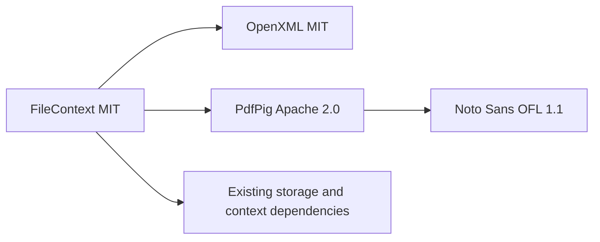

# Dependency licenses

The 1.0.1 runtime package uses dependencies with MIT, Apache-2.0 or BSD licenses. The embedded Noto Sans font uses OFL-1.1. None of these components requires a paid commercial license or binary maintenance agreement. Preserve their license and attribution notices when redistributing.

| Component | Version | License | Role |
|---|---|---|---|
| DocumentFormat.OpenXml / Framework | 3.5.1 | MIT | Workbook creation |
| PdfPig | 0.1.16 | Apache-2.0 | PDF creation |
| Noto Sans Regular | Bundled font | OFL-1.1 | Embedded Latin/Cyrillic font; notice included in NuGet |
| .NET runtime | net10.0 | MIT | CSV/text encoding |
| ManagedCode storage, Markdown-LD, Microsoft Agent Framework and extensions | Centrally pinned | MIT | Storage, context and tool integration |
| Lucene.Net family / J2N | 4.8.0-beta00017 / 2.1.0 | Apache-2.0 | Existing Markdown-LD transitive search dependencies |

The audit inspects the restored NuGet package metadata and embedded license files, not only repository badges. The product dependency closure was reviewed before release. SonarAnalyzer.CSharp is an existing private build dependency under the Sonar Source-Available License, royalty-free for non-competing use. It is not a runtime dependency of the published package and is not represented as MIT. xUnit, LlmTck and filesystem fixtures remain test-only.

Sources: [OpenXML license](https://github.com/dotnet/Open-XML-SDK/blob/main/LICENSE), [PdfPig license](https://github.com/UglyToad/PdfPig/blob/master/LICENSE), [Noto license](https://github.com/notofonts/noto-fonts/blob/main/LICENSE), [Sonar analyzer license](https://github.com/SonarSource/sonar-dotnet/blob/master/LICENSE).
