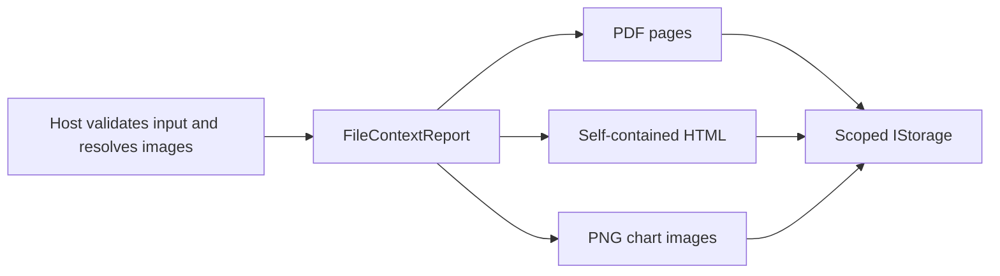

# Branded reports

`FileContextDocumentService.CreateReportAsync` generates a `FileContextReportResult` containing scoped file references. The caller supplies a title, base file name, ordered blocks, output kinds (`pdf`, `html`, `png`), Letter/A4 page size, portrait/landscape orientation, and server-resolved visual theme. The library never fetches URLs or loads external fonts. A host must resolve and validate remote images before passing base64 PNG/JPEG bytes in an `image` block.

Block content is JSON:

- `heading`: `title`, optional `subtitle`.
- `text`: `text` with bold spans (`**bold**`), dash bullets, and HTTPS Markdown links.
- `kpi-row`: `items` with 2-6 entries containing `label`, `value`, optional `change`, and optional `indicator` (`up` or `down`).
- `chart`: `title`, `chartType` (`line`, `bar`, `stacked-bar`, `pie`, `donut`), `labels`, `series` entries with `name` and numeric `values`, optional `xAxis` and `yAxis`.
- `table`: `columns` with `key`, `label`, optional .NET numeric `format`; `rows` as objects; optional `totals` object and `highlightCells` entries with zero-based `row` and column `key`.
- `image`: base64 PNG/JPEG bytes in `base64`, optional `caption`.
- `callout`: `text`.
- `page-break`: empty content.

All requested outputs render in memory before FileContext stores any file. Validation caps the expanded report at 10 MB, PDF at 60 pages, and render time at 60 seconds. Image blocks are capped at 5 MB. PDF chart and table rows are kept intact across pages, table headers repeat after a page break, and each page has a title, NYWD mark or theme logo, UTC date, and page number. Failures name the block index and type where possible.

Named template and theme persistence, network allowlists, operator authorization, and authenticated download links belong to the host. `AIAgents.App` implements that boundary in its `AgentFiles/Reports` module.
