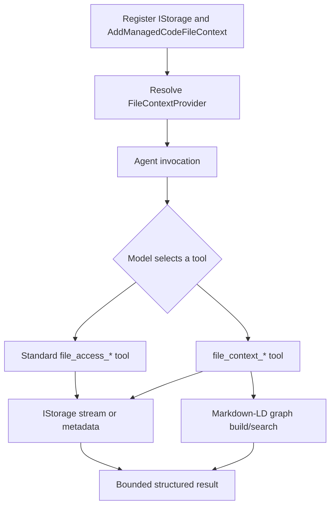

# Storage-backed file context

## Scope

ManagedCode.FileContext lets an Agent Framework agent work with files from any ManagedCode.Storage provider and query Markdown files as a knowledge graph.

In scope: standard file access, bounded line navigation, metadata, Markdown graph retrieval/export, DI, path isolation, and deterministic tool-loop testing. Out of scope: provider credentials, direct model hosting, binary document parsing, and an alternative file protocol.

## Rules

1. Every logical path is relative, uses `/`, and is resolved under the configured storage prefix.
2. Rooted paths, backslashes, null bytes, `.` segments, and `..` segments are rejected before storage access.
3. The adapter implements the complete Agent Framework `AgentFileStore` contract using only `IStorage`.
4. Standard tools come from Agent Framework `FileAccessProvider`: read, list, grep, write, delete, replace, and replace-lines.
5. Write tools are disabled by default. When enabled, Agent Framework approval remains required unless the host explicitly disables it.
6. Full reads fail before allocation when metadata exceeds `MaximumFullReadBytes`.
7. Range reads are 1-based by line, stream sequentially, return continuation metadata, and stop at configured line/byte limits.
8. Content search is case-insensitive regular expression search with a timeout, file/match/result limits, and optional standard glob filtering.
9. Directory listing returns direct child directories before direct child files and does not leak the configured storage prefix.
10. Markdown graph builds include only selected `.md` files within configured limits and use `ManagedCode.MarkdownLd.Kb`.
11. Graph search returns package-owned match records; graph export supports JSON-LD, Turtle, Mermaid, and DOT with an output limit.
12. Each graph operation builds from the current selected storage contents, so graph results cannot become stale between calls.
13. The context provider injects capability instructions and tools, not arbitrary file content as system instructions.
14. DI supports both the default `IStorage` and a named/keyed `IStorage` registration.
15. The NuGet package has version `0.0.1`; publication occurs only from the GitHub Actions release workflow.

## Main flow

## Failure flows

- Unsafe paths fail with `ArgumentException`; the storage provider is not called.
- Missing files return `null` through the `AgentFileStore` and metadata contracts; a range read throws `FileNotFoundException`.
- Storage failures become `IOException` values with the operation and safe logical path, preserving the provider's safe problem detail.
- Invalid or catastrophic regex patterns fail deterministically; a regex timeout does not hang the agent invocation.
- Oversized files, result sets, or graph exports stop at configured boundaries and report truncation or a clear limit failure.
- Graph operations with no matching Markdown input fail clearly instead of inventing an empty knowledge base.

## Verification scenarios

1. Write, read, exists, list, grep, and delete through `ManagedCodeStorageFileStore` against real filesystem storage.
2. Prefix isolation and path-traversal rejection.
3. Direct-child listing across nested blob keys.
4. Range navigation forward and backward using returned line metadata, including a non-seekable stream path.
5. Regex/glob search limits and timeout behavior.
6. Markdown graph build, ranked search, current-content rebuild, and all export formats.
7. Default and keyed Microsoft DI resolution.
8. Agent Framework receives standard and extended tools from `FileContextProvider`.
9. A real Agent Framework loop receives an LlmTck tool call, executes storage-backed `file_access_read`, proves the file content reaches the second model request, and returns the expected final answer.
10. The packed `0.0.1` package installs and runs in a clean smoke project.

## Definition of done

- All rules have automated coverage at the highest useful boundary.
- Formatting, Release build, full tests, coverage, package validation, and clean-install smoke checks pass locally.
- README and durable docs describe only the implemented API.
- GitHub Actions validates `main` and publishes NuGet only from an explicit matching version tag.
